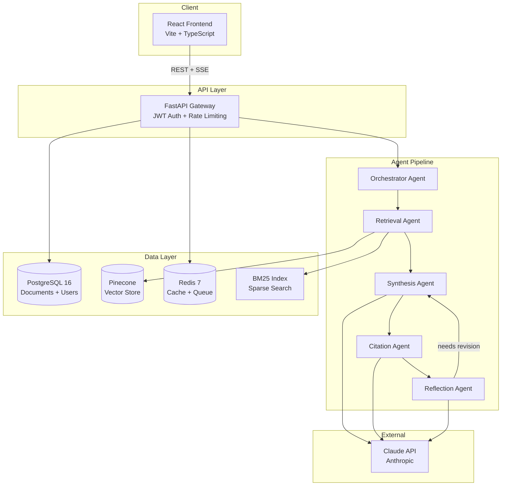
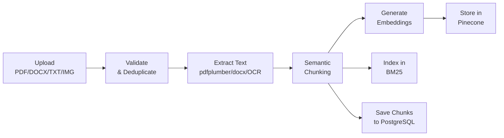
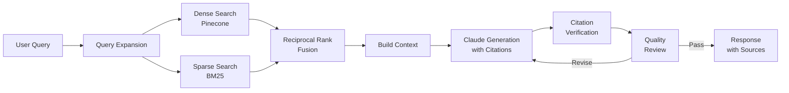
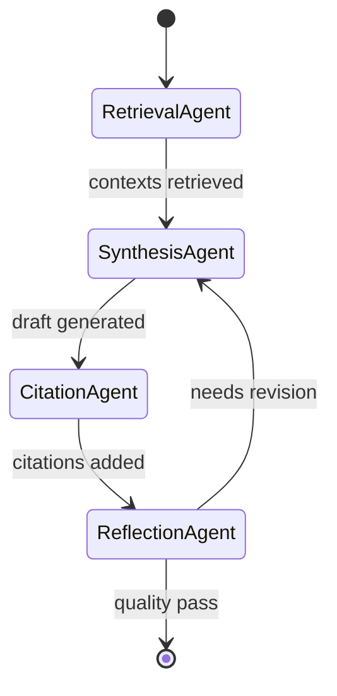

# IntelliDoc Nexus

> Multi-agent RAG-powered document intelligence platform

[](https://github.com/your-org/intellidoc-nexus/actions/workflows/ci.yml)
[](https://www.python.org/downloads/)
[](https://reactjs.org/)
[](https://fastapi.tiangolo.com/)
[](LICENSE)

IntelliDoc Nexus is a production-ready document intelligence platform that combines multi-agent AI orchestration with hybrid retrieval-augmented generation (RAG). Upload documents (PDF, DOCX, TXT, images), ask questions, and get cited answers powered by Claude.

---

## Architecture

### System Overview



### Document Ingestion Pipeline



### Hybrid Search & RAG Pipeline



### Multi-Agent System



| Agent | Responsibility |
|-------|---------------|
| **Retrieval** | Query expansion, hybrid search (dense + sparse), RRF fusion |
| **Synthesis** | Cross-source answer generation using Claude |
| **Citation** | Source verification and `[Source N]` annotation |
| **Reflection** | Quality scoring with PASS/REVISE verdict and feedback loop |
| **Orchestrator** | Pipeline coordination with max-revision guards |

---

## Tech Stack

| Layer | Technology |
|-------|-----------|
| **Frontend** | React 18, TypeScript, Vite, Tailwind CSS, Zustand, TanStack Query, Radix UI |
| **Backend** | FastAPI, Python 3.11+, SQLAlchemy 2.0 (async), Pydantic v2 |
| **LLM** | Claude (Anthropic API) with streaming SSE |
| **Vector Store** | Pinecone (serverless) with namespace multi-tenancy |
| **Sparse Search** | BM25Okapi (in-memory, per-user namespace) |
| **Database** | PostgreSQL 16 (async via asyncpg) |
| **Cache/Queue** | Redis 7 (caching + Celery broker) |
| **Task Queue** | Celery 5.3 (background processing) |
| **Auth** | JWT (python-jose) + bcrypt |
| **Monitoring** | Prometheus metrics + Grafana dashboards |
| **Infrastructure** | Docker Compose, Terraform (AWS ECS/ECR/S3/ALB) |
| **CI/CD** | GitHub Actions (lint, test, build, deploy) |

---

## Quick Start

### Prerequisites

- Docker Desktop (v24+)
- Git

### 1. Clone and configure

```bash
git clone https://github.com/your-org/intellidoc-nexus.git
cd intellidoc-nexus
cp backend/.env.example backend/.env
```

Edit `backend/.env` to add your API keys:

```env
ANTHROPIC_API_KEY=sk-ant-...        # Required for RAG queries
PINECONE_API_KEY=...                 # Optional: enables vector search
```

### 2. Start the platform

```bash
cd infrastructure
docker compose up --build
```

This starts 4 services:
- **Backend API**: http://localhost:8000 (FastAPI + Swagger docs at `/docs`)
- **Frontend**: http://localhost:3000 (React app)
- **PostgreSQL**: localhost:5432
- **Redis**: localhost:6379

### 3. Use the platform

1. Open http://localhost:3000
2. Login with the dev account: `dev@intellidoc.ai` / `devpassword123`
3. Upload a document (PDF, DOCX, TXT, or image)
4. Ask questions in the chat interface
5. View cited responses with source references

---

## Development Setup

### Backend (without Docker)

```bash
cd backend
python -m venv venv
source venv/bin/activate
pip install -r requirements.txt

# Start PostgreSQL and Redis locally, then:
cp .env.example .env
# Edit .env with local database URLs

uvicorn app.main:app --reload --host 0.0.0.0 --port 8000
```

### Frontend (without Docker)

```bash
cd frontend
npm install
npm run dev
```

The frontend dev server runs at http://localhost:5173 with HMR.

### Running Tests

```bash
# Backend tests
cd backend
pytest -v --tb=short

# With coverage
pytest --cov=app --cov-report=term-missing

# Frontend type checking
cd frontend
npx tsc --noEmit
```

---

## API Reference

All endpoints are prefixed with `/api/v1`. Interactive docs at http://localhost:8000/docs.

### Authentication

| Method | Endpoint | Description |
|--------|----------|-------------|
| `POST` | `/api/v1/auth/register` | Register a new user |
| `POST` | `/api/v1/auth/login` | Login and get JWT token |
| `GET` | `/api/v1/auth/me` | Get current user profile |

### Documents

| Method | Endpoint | Description |
|--------|----------|-------------|
| `POST` | `/api/v1/documents/upload` | Upload a document |
| `GET` | `/api/v1/documents/` | List user's documents |
| `GET` | `/api/v1/documents/{id}` | Get document with chunks |
| `DELETE` | `/api/v1/documents/{id}` | Delete a document |

### Chat

| Method | Endpoint | Description |
|--------|----------|-------------|
| `POST` | `/api/v1/chat/` | Send a chat query (supports `?use_agents=true`) |
| `POST` | `/api/v1/chat/stream` | Stream a chat response via SSE |

### Sessions

| Method | Endpoint | Description |
|--------|----------|-------------|
| `GET` | `/api/v1/sessions/` | List chat sessions |
| `POST` | `/api/v1/sessions/{id}/share` | Share a session (get share token) |
| `DELETE` | `/api/v1/sessions/{id}/share` | Unshare a session |
| `GET` | `/api/v1/sessions/shared/{token}` | View a shared session |
| `GET` | `/api/v1/sessions/{id}/export` | Export session as Markdown |
| `DELETE` | `/api/v1/sessions/{id}` | Delete a session |

### Health

| Method | Endpoint | Description |
|--------|----------|-------------|
| `GET` | `/api/v1/health/` | Health check |
| `GET` | `/api/v1/health/metrics` | Prometheus metrics |

---

## Project Structure

```
intellidoc-nexus/
├── backend/
│   ├── app/
│   │   ├── agents/              # Multi-agent system
│   │   │   ├── orchestrator.py  # Pipeline coordinator
│   │   │   ├── retrieval_agent.py
│   │   │   ├── synthesis_agent.py
│   │   │   ├── citation_agent.py
│   │   │   ├── reflection_agent.py
│   │   │   └── state.py         # Shared agent state
│   │   ├── api/v1/endpoints/    # REST endpoints
│   │   ├── core/                # Config, logging, security
│   │   ├── db/                  # Session, seed, migrations
│   │   ├── middleware/          # Rate limit, metrics, security headers
│   │   ├── models/              # SQLAlchemy models
│   │   ├── schemas/             # Pydantic request/response
│   │   ├── services/            # Business logic
│   │   │   ├── ingestion.py     # Document pipeline orchestrator
│   │   │   ├── rag.py           # RAG pipeline with hybrid search
│   │   │   ├── vector_store.py  # Pinecone integration
│   │   │   ├── bm25_search.py   # Sparse search
│   │   │   ├── chunker.py       # Semantic chunking
│   │   │   ├── document_processor.py  # Text extraction
│   │   │   └── embedding.py     # Sentence-transformers
│   │   └── main.py              # FastAPI app entry
│   ├── tests/
│   │   ├── unit/                # 28+ unit tests
│   │   └── integration/         # API + auth integration tests
│   ├── Dockerfile
│   └── requirements.txt
├── frontend/
│   ├── src/
│   │   ├── components/          # React components
│   │   ├── hooks/               # Custom hooks
│   │   ├── pages/               # Page components
│   │   ├── services/            # API client
│   │   ├── stores/              # Zustand state
│   │   └── App.tsx
│   ├── Dockerfile
│   └── package.json
├── infrastructure/
│   ├── docker-compose.yml       # 4-service stack
│   ├── terraform/               # AWS IaC (ECS, ECR, S3, ALB)
│   └── monitoring/              # Prometheus + Grafana
├── .github/workflows/ci.yml     # CI/CD pipeline
└── README.md
```

---

## Configuration

### Environment Variables

| Variable | Default | Description |
|----------|---------|-------------|
| `APP_ENV` | `development` | Environment (`development`, `production`) |
| `SECRET_KEY` | `change-me-in-production` | JWT signing key |
| `DATABASE_URL` | `postgresql+asyncpg://...` | Async PostgreSQL URL |
| `REDIS_URL` | `redis://redis:6379/0` | Redis connection URL |
| `ANTHROPIC_API_KEY` | _(empty)_ | Claude API key for RAG |
| `PINECONE_API_KEY` | _(empty)_ | Pinecone vector store key |
| `PINECONE_INDEX_NAME` | `intellidoc-index` | Pinecone index name |
| `AWS_ACCESS_KEY_ID` | _(empty)_ | AWS credentials |
| `AWS_SECRET_ACCESS_KEY` | _(empty)_ | AWS credentials |
| `S3_BUCKET_NAME` | `intellidoc-documents` | S3 bucket for files |

---

## Deployment

### AWS (Terraform)

```bash
cd infrastructure/terraform
terraform init
terraform plan
terraform apply
```

This provisions:
- VPC with public subnets
- ECS Fargate cluster
- ECR repositories for backend + frontend
- S3 bucket (encrypted, versioned)
- Application Load Balancer with health checks
- Security groups

### CI/CD Pipeline

The GitHub Actions workflow (`.github/workflows/ci.yml`) runs:

1. **Test** - Linting (ruff), unit tests (pytest), type checking (tsc)
2. **Build** - Docker image builds for backend and frontend
3. **Deploy** - Push to ECR, update ECS service (on `main` branch)

---

## Monitoring

Prometheus metrics are exposed at `/api/v1/health/metrics`:

- `http_requests_total` - Request count by method, path, status
- `http_request_duration_seconds` - Request latency histogram
- `http_requests_in_progress` - Active connections gauge

Import the Grafana dashboard from `infrastructure/monitoring/grafana-dashboard.json`.

---

## License

MIT
